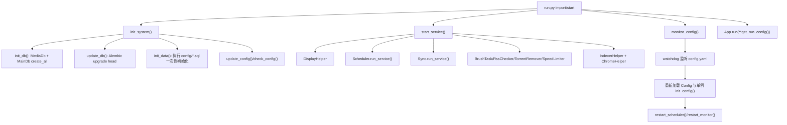
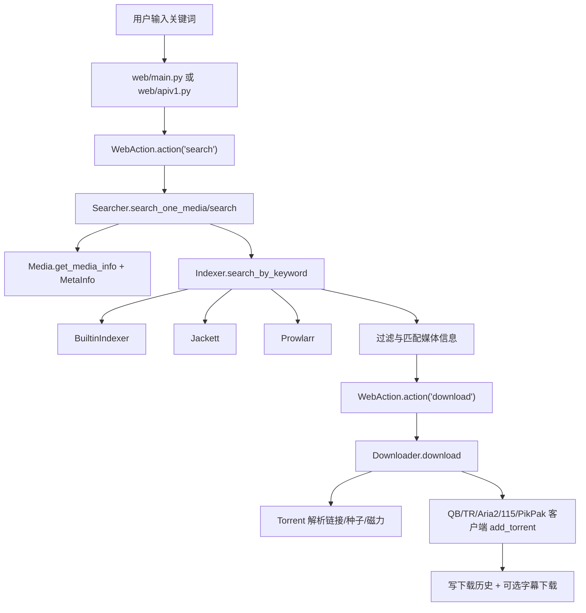
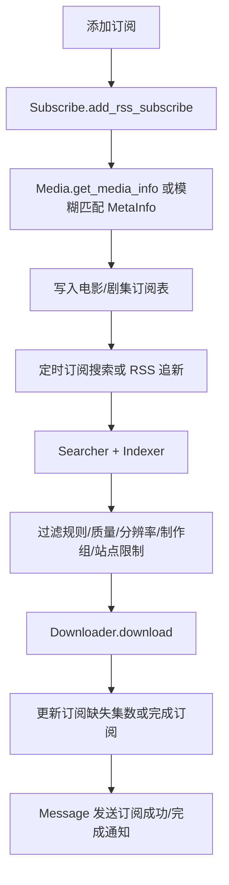
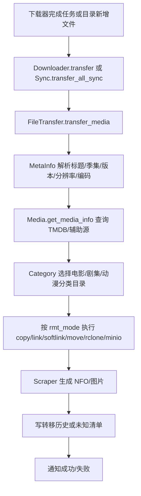

# NAStool 项目架构与业务流程

本文面向后续维护者和 Codex 代理，记录当前仓库的架构、技术栈、核心业务流程与开发注意事项。

## 项目定位

NAStool 是一个面向 NAS 场景的影视资源自动化管理工具。它把站点资源检索、RSS/豆瓣订阅、下载器任务创建、下载完成后的媒体识别整理、媒体库元数据刮削、站点养护和消息通知整合到一个 Flask Web 应用中。

典型使用链路是：

1. 用户通过 Web、API 或消息机器人发起搜索/订阅/服务操作。
2. 系统通过内置索引器、Jackett 或 Prowlarr 检索资源。
3. 命中资源后调用下载器客户端添加任务。
4. 下载完成或目录文件变化后触发媒体识别、重命名和转移。
5. 结果写入 SQLite 历史表，并通过消息中心发送通知。

## 技术栈

运行时：

- Python 3.10。
- Flask 2.1.2 作为 Web 服务。
- Flask-Login 负责页面登录态。
- flask-restx 提供 `/api/v1/` REST API 与 Swagger 页面。
- SQLAlchemy 1.4 + SQLite 存储主业务数据和媒体缓存。
- Alembic 负责 `db_scripts/` 数据库迁移。
- APScheduler 运行周期性服务。
- watchdog 监听配置文件和目录变化。
- requests、BeautifulSoup、lxml、pyquery、parsel、Selenium、undetected-chromedriver 用于 HTTP、HTML 解析与站点交互。
- qbittorrent-api、transmission-rpc、aria2 XML-RPC、115、PikPak 客户端用于下载器集成。
- tmdbv3api 相关代码、豆瓣/Bangumi 客户端用于媒体信息检索。
- loguru 在依赖中存在，项目实际日志入口主要是根目录 `log.py` 封装的 Python logging。

前端：

- 服务端 Jinja2 模板位于 `web/templates/`。
- 静态资源位于 `web/static/`。
- UI 基于 Tabler、Bootstrap 风格资源、jQuery、少量 Lit 组件。
- 当前不是 npm 构建型前端，页面直接由 Flask 渲染模板并加载静态 JS/CSS。

部署：

- `run.py` 可本地直接启动。
- Docker 镜像基于 Alpine，默认暴露 `3000`，配置路径默认 `/config/config.yaml`。
- Windows 可通过冻结可执行文件模式启动托盘。
- 关键环境变量包括 `NASTOOL_CONFIG`、`NASTOOL_LOG`、`TZ`、`NASTOOL_AUTO_UPDATE`、`NASTOOL_CN_UPDATE`。

测试：

- 从仓库根目录运行测试时使用 `python -m tests.run`。
- 直接运行 `python tests/run.py` 在当前 Windows 环境会因模块导入路径缺少仓库根而失败。
- 若当前 Python 或 `.venv` 缺少 `requirements.txt` 中依赖，例如 `ruamel.yaml`，测试会在项目导入阶段失败，应先安装依赖。
- 已有测试主要覆盖 `app/media/meta` 的名称识别逻辑。

## 目录结构

```text
.
├── run.py                    # 主进程入口，初始化系统并启动 Web/定时/监控服务
├── config.py                 # 全局配置单例，读取 NASTOOL_CONFIG 指向的 config.yaml
├── check_config.py           # 配置升级与配置合法性检查
├── log.py                    # 日志封装和 Web 日志队列
├── app/
│   ├── conf/                 # 模块静态配置、系统配置、站点配置
│   ├── db/                   # SQLAlchemy 模型、主库、媒体缓存库、迁移入口
│   ├── downloader/           # 下载器聚合层和 QB/TR/Aria2/115/PikPak 客户端
│   ├── helper/               # 横切 helper，如索引器加载、字典、浏览器、线程、安全等
│   ├── indexer/              # 内置/Jackett/Prowlarr 索引器策略
│   ├── media/                # 媒体识别、TMDB/豆瓣/Bangumi、NFO/图片刮削
│   ├── mediaserver/          # Emby/Jellyfin/Plex 客户端和 Webhook
│   ├── message/              # 微信、Telegram、Slack、Bark 等消息渠道
│   ├── sites/                # 站点配置、Cookie、用户数据统计、站点类型适配
│   ├── utils/                # 通用工具、枚举、缓存、路径、HTTP、字符串等
│   ├── scheduler.py          # APScheduler 定时任务编排
│   ├── sync.py               # 目录监控和全量同步入口
│   ├── filetransfer.py       # 媒体转移、识别、重命名、刮削核心
│   ├── searcher.py           # 资源搜索编排
│   ├── subscribe.py          # 电影/剧集订阅状态管理和订阅搜索
│   ├── rss.py                # 站点 RSS 处理
│   ├── rsschecker.py         # 自定义 RSS 任务
│   ├── brushtask.py          # 刷流任务
│   ├── torrentremover.py     # 自动删种
│   ├── speedlimiter.py       # 播放联动限速
│   └── doubansync.py         # 豆瓣想看同步
├── web/
│   ├── main.py               # Flask App、页面路由、Webhook 入口
│   ├── apiv1.py              # REST API 命名空间和资源类
│   ├── action.py             # Web/API 命令分发中心
│   ├── security.py           # 页面/API 权限校验
│   ├── backend/              # 用户、搜索、Web 工具等后端辅助
│   ├── templates/            # Jinja2 页面模板
│   └── static/               # CSS、JS、图片和 Lit 组件
├── db_scripts/               # Alembic 数据库迁移
├── docker/                   # Dockerfile 和 entrypoint
├── tests/                    # unittest 测试
└── third_party/              # third_party.txt 指定的额外模块路径
```

## 启动架构

`run.py` 是主入口。导入 `web.main.App` 后，模块级代码会依次执行初始化、服务启动和配置监听。



注意点：

- `Config()` 是全局单例，构造时要求 `NASTOOL_CONFIG` 已设置。
- 配置文件不存在时会从内置 `config/config.yaml` 复制模板。
- `Config().init_syspath()` 会把 `third_party.txt` 指定目录加入 `sys.path`。
- 多数服务类通过 `app.utils.commons.singleton` 管理，全局实例保存在 `INSTANCES`。
- 配置文件变更会重载所有带 `init_config()` 的单例，再重启定时与目录监控。

## Web 与 API 架构

### 页面路由

`web/main.py` 创建 Flask `App`，配置 LoginManager、压缩、模板路由和 Webhook 路由。页面大多受 `@login_required` 保护，直接渲染 `web/templates/` 下模板。

核心页面包括：

- `/` 登录与导航。
- `/resources` 站点资源列表。
- `/site` 站点维护。
- `/downloading` 正在下载。
- `/rss`、`/user_rss` 订阅与自定义 RSS。
- `/indexer`、`/library`、`/mediaserver`、`/notification` 等设置页。

### REST API

`web/apiv1.py` 注册 `apiv1_bp`，使用 flask-restx 定义命名空间：

- `user`、`system`、`config`、`site`、`service`
- `subscribe`、`rss`、`recommend`、`search`、`download`
- `organization`、`torrentremover`、`library`、`brushtask`
- `media`、`sync`、`filterrule`、`words`、`message`、`douban`

认证分两类：

- `ApiResource` 使用 `require_auth`，面向密钥/API Token。
- `ClientResource` 使用 `login_required`，面向已登录 Web 客户端。

### 命令分发

`web/action.py` 的 `WebAction` 是 Web 页面和 API 的动作中心。`__init__()` 中维护 `_actions` 字典，把字符串命令映射到私有方法，例如：

- `search`、`download`、`download_link`、`download_torrent`
- `sch` 触发服务运行
- `update_config`、`add_or_edit_sync_path`
- `rename`、`rename_udf`、`re_identification`
- `add_rss_media`、`remove_rss_media`
- `update_downloader`、`update_message_client`、`update_torrent_remove_task`

`action(cmd, data)` 返回内部结构，`api_action(cmd, data)` 会统一转换为 `{code, success, message, data}`。新增 API 时通常需要同时更新 `web/apiv1.py` 和 `WebAction._actions`。

## 配置与持久化

配置分三层：

- `config.py` 读取 `NASTOOL_CONFIG` 指向的 YAML，是主配置来源。
- `app/conf/moduleconf.py` 保存模块级静态字典和枚举映射。
- `app/conf/systemconfig.py` 把部分运行期系统设置持久化到数据库字典表并缓存。
- `app/conf/siteconf.py` 和 `app/sites/` 处理站点配置与站点类型差异。

数据库：

- 主库是 `Config().get_config_path()/user.db`。
- `app/db/models.py` 定义 SQLAlchemy 模型。
- `MainDb` 负责主业务库会话、初始化和事务装饰器。
- `MediaDb` 负责媒体缓存相关库。
- `db_scripts/` 是 Alembic 迁移目录，`update_db()` 启动时升级到 `head`。

## 定时任务与后台服务

`app/scheduler.py` 使用 APScheduler 编排周期性服务，启动入口是 `run_scheduler()`，重载入口是 `restart_scheduler()`。Web/API 可通过 `WebAction` 的 `sch` 命令触发指定服务。

主要后台服务：

- `Downloader.transfer()`：轮询下载器完成任务并调用 `FileTransfer.transfer_media()`。
- `Rss`/`Subscribe`：订阅搜索与 RSS 追新。
- `RssChecker`：自定义 RSS。
- `DoubanSync`：豆瓣想看同步，支持直接搜索或加入订阅。
- `Sites`/站点签到：站点数据统计与签到。
- `BrushTask`：刷流下载。
- `TorrentRemover`：自动删种。
- `SpeedLimiter`：媒体服务器播放状态联动下载器限速。
- `Sync`：目录监控和全量同步。

## 核心业务流程

### 资源搜索与下载



关键规则：

- `Indexer.search_by_keyword()` 会按索引器站点并发搜索。
- 内置索引器基于 `app/indexer/client/_spider.py` 的站点解析配置提取标题、详情页、下载链接、体积、做种数等字段。
- `Downloader.download()` 根据下载设置选择默认下载器、下载目录、分类、标签、限速、分享率和做种时间。
- 非磁力 HTTP 链接会先下载/解析种子；站点可配置 Cookie、UA、Referer、代理和字幕下载。

### 订阅与 RSS



订阅状态：

- 非模糊订阅会先查 TMDB，电影和剧集分别写入不同表。
- 剧集订阅会计算季、总集数、缺失集数。
- 豆瓣同步可以把想看条目直接搜索下载，也可以转换为订阅。
- `finish_rss_subscribe()` 会写订阅历史、删除当前订阅并发送通知。

### 下载完成与媒体整理



支持的转移模式：

- `copy`：复制。
- `link`：硬链接，要求源和目标在同一文件系统。
- `softlink`：软链接，路径映射必须一致。
- `move`：移动并删除原文件。
- `rclone`：面向 rclone 网盘场景。
- `minio`：面向 S3/MinIO 场景。

`Sync` 目录同步有两种模式：

- `onlylink`：只做硬链接/同步，不做识别重命名。
- 普通模式：扫描一级媒体文件/目录，调用 `FileTransfer.transfer_media()` 识别整理。

### 媒体识别

识别入口是 `app/media/meta/metainfo.py` 的 `MetaInfo(title, subtitle=None, mtype=None)`：

1. 先经过 `WordsHelper().process()` 应用自定义识别词。
2. 判断输入是否媒体文件以及是否动漫。
3. 动漫走 `MetaAnime`，普通影视走 `MetaVideo`。
4. 识别出的名称、年份、季集、版本、分辨率、编码等信息交给 `Media.get_media_info()`。
5. `Media` 按类型和年份查询 TMDB，必要时去掉年份、使用 TMDB Web 或搜索引擎辅助。
6. 命中后把 TMDB 信息写入 `MetaInfo`，并可生成缓存。

此链路是中文资源整理准确性的核心，修改前后应优先运行 `python -m tests.run`。

### 站点养护

站点能力分布在：

- `app/sites/sites.py`：站点列表、属性、下载设置、统计。
- `app/sites/siteuserinfo/`：NexusPHP、Gazelle、Unit3D、Discuz、TNode 等站点用户信息适配。
- `app/sites/sitecookie.py`：站点 Cookie 相关处理。
- `app/brushtask.py`：刷流任务，控制任务数量、体积、下载器状态。
- `app/torrentremover.py`：按规则自动删种。

### 消息通知和远程控制

消息入口在 `app/message/message.py` 和 `app/message/message_center.py`，具体渠道在 `app/message/client/`：

- 微信、Telegram、Slack、Synology Chat 支持远程控制或回调。
- Bark、PushPlus、Server酱、PushDeer、Chanify、Gotify、IYUU 等偏通知。
- Webhook 路由由 `web/main.py` 接入，不同渠道会把命令转回 `WebAction` 或服务方法。

## 横切设计约定

- 大量服务类是单例，修改配置后需要实现或复用 `init_config()`。
- Web/API 新动作通常经过 `WebAction._actions`，避免绕过统一返回结构。
- 下载器、索引器、媒体服务器、消息渠道均采用“聚合层 + client 子类”的策略式结构。
- 对外部站点和下载器操作通常要容忍网络失败、Cookie 失效、权限不足和重复任务。
- 中文文件名、中文正则和 Windows 编码是高频风险点，Windows 下读取中文文件要显式 UTF-8。
- 媒体文件整理涉及真实文件移动/删除，测试时应使用临时目录，避免对真实媒体库执行破坏性操作。

## 开发与验证建议

常用命令：

```powershell
python -m tests.run
python run.py
```

本地启动要求：

- 设置 `NASTOOL_CONFIG` 指向可写的 `config.yaml`。
- 运行测试前确认已安装 `requirements.txt`；当前环境如果缺 `ruamel.yaml`，`python -m tests.run` 会在导入阶段失败。
- 需要 TMDB API Key 才能完整验证媒体检索链路。
- 涉及 Selenium/Chrome 的功能需要可用 ChromeDriver 或容器内 chromium。

修改建议：

- 改媒体识别：重点看 `app/media/meta/`、`tests/cases/meta_cases.py`、`tests/test_metainfo.py`。
- 改搜索/订阅：重点看 `app/searcher.py`、`app/subscribe.py`、`app/rss.py`、`app/indexer/`。
- 改下载/整理：重点看 `app/downloader/downloader.py`、`app/filetransfer.py`、`app/sync.py`。
- 改 Web/API：重点看 `web/apiv1.py`、`web/action.py`、`web/main.py`、相关模板。
- 改配置：重点看 `config.py`、`check_config.py`、`config/config.yaml`、`app/conf/`。

高风险区域：

- `web/action.py` 是大体量命令分发文件，新增命令时要保持返回结构一致。
- `app/filetransfer.py` 会触发文件移动、删除、链接和远程同步。
- `app/downloader/downloader.py` 会连接真实下载器并可能删除种子或文件。
- `app/scheduler.py` 和 `app/sync.py` 会启动后台线程/监听器，避免重复启动本地服务。
- 数据库迁移必须同时考虑新安装、老版本升级和配置初始化。
